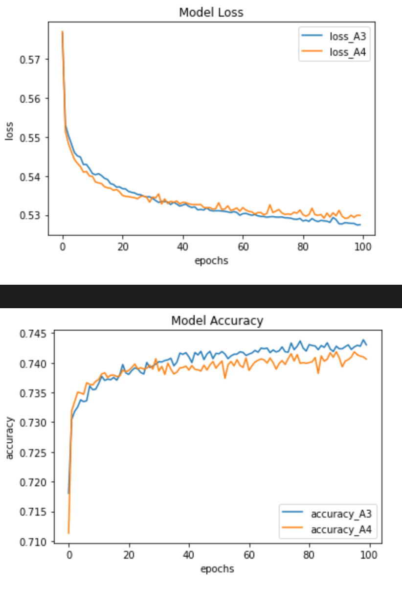

# Startup analyzer with neural nets

This project attempts to analyze startups to predict if they will be successful if they recieve funding by using neural nets.

---

## Technologies

This project leverages python 3.7.9 with the following packages:

* [pandas](https://pandas.pydata.org/docs/) - For the analysis startup information.

* [sklearn](https://scikit-learn.org/stable/) - For scaling and creating training and testing data for the neural net.

* [tensorflow](https://www.tensorflow.org/) - For analysis of startup information using neural nets.


On the terminal, under the conda dev environment, install the following:

---

## Installation Guide

Before running the application first install the following dependencies.

```
  pip install pandas

  pip install --upgrade tensorflow

```

---

## Analysis

For this project I looked at 5 different models over 100 epochs each:


1. Baseline
    - Hidden layers: 2
    - Hidden activation function: relu

2. A1 (Baselie with more hidden layers)
    - Hidden layers: 6
    - Hidden activation function: relu

3. A2 (Baseline with different activation function for hidden layer)
    - Hidden layers: 2
    - Hidden activation function: selu

4. A3 (Baseline with different activation function for hidden layer)
    - Hidden layers: 2
    - Hidden activation function: gelu

5. A4 (A3 with morer hidden layers))
    - Hidden layers: 6
    - Hidden activation function: gelu

If I compare the baseline model to A1, the same model but with 6 hidden layers, we can see that adding more layers does not improve the loss or accuracy significantly.


Next, I try to see if I can get any improvement by changing the hidden layers activation function. I compare two models to the baseline which uses relu. First I use selu with the A2 model and gelu with the A3 model. We can see that compared to the baseline the A3 model that uses the gelu activation function for the hidden layers shows the most promising results. But, just slightly better than the results obtained from the baseline model.


Finally, I compare the model A3, which uses the gelu activation function and 2 hidden layers, to model A4, which uses the gelu activation function and 6 hidden layers. This comparison also shows, that for 100 epochs, the model with fewer hidden layer still performs better.


---

## Contributors 

Nathan Patterson

---

## License

MIT
